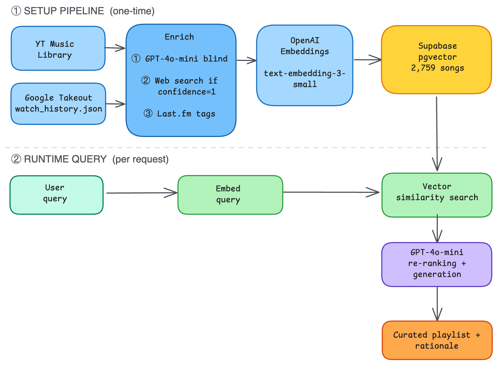

# Personal AI DJ 🎧

**Natural language playlist generator for YouTube Music.**
Multi-source song enrichment, semantic embeddings, and vector search to match any mood or moment.

**Live demo: [personal-ai-dj.streamlit.app](https://personal-ai-dj.streamlit.app/)**


---

## The story

I use YouTube Music, not Spotify. When a [February 2026 episode of Hard Fork](https://www.nytimes.com/2026/02/13/podcasts/something-big-is-happening-ai-rocks-the-romance-novel-industry-one-good-thing.html) brought Spotify's [new AI-powered playlist feature](https://techcrunch.com/2026/01/22/spotify-brings-ai-powered-prompted-playlists-to-the-u-s-and-canada/) to my attention, I wondered: could I build something like that for my own YT Music account? It turned out to be a trickier endeavour than I expected :).

- **No official YouTube Music API.** I used [ytmusicapi](https://github.com/sigma67/ytmusicapi), a reverse-engineered Python library that authenticates via browser cookies, to extract my library: recent listening history, saved songs, and all playlists.

- **Play history is not exposed through that API either.** As I wanted to query my library based on listening behaviour (e.g. "only songs I haven't listened to in a while"), I needed to overlay that data separately. I extracted it from a [Google Takeout](https://takeout.google.com) export, parsing `watch_history.json` to compute play counts and last-played dates for each song.

- **LLM enrichment for embeddings works well for well-known tracks, but not for obscure ones.** Much of my library sits outside mainstream Western pop, and GPT-4o-mini simply did not have reliable information for many of those songs. I introduced a confidence score (1 = uncertain, 2 = confident) at enrichment time, and routed low-confidence songs through additional web sources before embedding. I also considered using Spotify's audio features (valence, energy, danceability, and others) as an enrichment signal, but I discovered Spotify [deprecated those from their public API in late 2024](https://developer.spotify.com/blog/2024-11-27-changes-to-the-web-api).

The result is a RAG system built entirely over my own listening history: 2,759 songs, described, embedded, and stored in a vector database, ready to match any mood or moment.

---

## How it works



### Setup pipeline (one-time)

```
YT Music Library  --+
                    +--> Enrich --> Embed --> Supabase pgvector
Google Takeout    --+
```

1. **Extract** (`extract.py`) — ytmusicapi pulls the full library: recent listening history, saved songs, and all playlists. Songs are deduplicated by `videoId`.
2. **Enrich** (`enrich.py`, `web_enrich.py`, `lastfm_enrich.py`) — three-stage enrichment per song:
   - GPT-4o-mini describes the song's sound, mood, and feel from its own knowledge. A `gpt_confidence` score (1 = uncertain, 2 = confident) is assigned.
   - If `confidence = 1`, a web search fetches additional context and re-enriches the description.
   - Last.fm tags are appended to the embedded text as a genre/mood signal boost.
3. **Play history** — [Google Takeout](https://takeout.google.com) `watch_history.json` is parsed to attach `play_count` and `last_played` to each song. These are stored as metadata in Supabase, not embedded.
4. **Embed** (`embed.py`) — `text-embedding-3-small` (1536 dimensions) generates a vector for each song's enriched description. All songs are upserted into Supabase pgvector.

> **Note:** Song titles are deliberately excluded from the embedded text. This prevents superficial keyword matching: a search for "sad" should surface songs that actually sound sad, not songs with "sad" in the title.

### Runtime query (per request)

```
User query --> Embed query --> Vector search (top 20) --> GPT-4o-mini --> Curated playlist
                                       ^
                                 Supabase pgvector
```

1. The user's natural language prompt is embedded with the same `text-embedding-3-small` model.
2. Supabase `match_songs` performs cosine similarity search and returns the top 20 candidates, including their `play_count` and `last_played` metadata.
3. GPT-4o-mini re-ranks and filters the candidates (selecting 6-12) and writes a one-sentence rationale for each song. Play history is used as a soft signal: recent/frequent plays are favoured for comfort-seeking queries; old/unplayed tracks are favoured for discovery queries.

---

## Tech stack

| Layer | Tool |
|---|---|
| Library extraction | ytmusicapi (unofficial, browser auth) |
| Play history | Google Takeout / `watch_history.json` |
| Enrichment | GPT-4o-mini · Brave Search · Tavily · OpenAI web search · Last.fm |
| Embeddings | OpenAI text-embedding-3-small (1536 dimensions) |
| Vector database | Supabase + pgvector |
| LLM curation | GPT-4o-mini |
| Frontend | Streamlit |
| Deployment | Streamlit Community Cloud |

---

## Key design decisions

**Confidence scoring**

As I found out during initial enrichment testing, GPT-4o-mini knows major artists well but struggles with obscure or non-English tracks. A confidence score (1 = uncertain, 2 = confident) is therefore assigned at enrichment time. Low-confidence songs are automatically routed through web search for re-enrichment, without reprocessing songs GPT already described well.

**Web search enrichment and cost**

I initially used OpenAI web search for re-enrichment, which produced the highest-quality descriptions but proved expensive at scale. After testing Tavily as a cheaper alternative, I settled on Brave Search as the best balance of quality and cost for this volume.

**Last.fm tags**

Last.fm genre and mood tags are appended to each song's embedded text as an additional signal. These tags give the retrieval step more to work with on tracks that even web search could not fully characterise.

**Title excluded from embeddings**

If song titles were included in the embedded text, a query like "something sad" would surface songs with "sad" in the title regardless of how they actually sound. Excluding titles forces retrieval to operate purely on musical description.

**Play history as a soft ranking signal**

`play_count` and `last_played` are stored as metadata rather than baked into the vectors. At query time, GPT is instructed to use them contextually: favour well-played songs for comfort requests, favour unplayed ones for discovery requests. When the query explicitly names a listening-time criterion (e.g. "songs I haven't heard in a while"), this signal becomes more deterministic: tracks with old or absent `last_played` dates are strongly preferred.

---

## Limitations and future work

**Data freshness.** Without an official API or OAuth support in the current version of ytmusicapi, the library is effectively a snapshot of my listening history as of March 2026. New songs added to YouTube Music won't appear in results, and there is no automated way to keep the index current.

**Playlist export back to YouTube Music.** For the same reason, automatically saving a generated playlist back to my YouTube Music account is not currently feasible.

**Embedding model.** I used `text-embedding-3-small` for cost and speed. Upgrading to `text-embedding-3-large` (3072 dimensions) could improve retrieval quality for nuanced mood queries, and would be worth exploring at larger scale.

**Enrichment cost at scale.** Per-song web search enrichment is expensive at the level of thousands of songs and would not scale to a library orders of magnitude larger. A more sustainable approach would be to enrich at the artist or album level, using that shared context as input when generating per-song descriptions.

**Spotify audio features.** Valence, energy, danceability and similar quantitative attributes would have been valuable enrichment signals, but Spotify [deprecated them from their public API in late 2024](https://developer.spotify.com/blog/2024-11-27-changes-to-the-web-api). A feasible alternative at larger scale would be audio analysis tools applied directly to the audio files.

---

## Project structure

```
app.py                        # Streamlit frontend
query.py                      # Runtime pipeline: embed, search, curate
embed.py                      # One-time pipeline: embed and upload to Supabase
extract.py                    # YT Music library extraction (ytmusicapi)
enrich.py                     # Stage 1: GPT-4o-mini blind enrichment
web_enrich.py                 # Stage 2: web search enrichment (low-confidence songs)
lastfm_enrich.py              # Stage 3: Last.fm tag fetching
confidence_score.py           # Confidence scoring logic
supabase_migration.sql        # Supabase schema (pgvector + match_songs function)
personal-ai-dj-diagram.png    # Architecture diagram
requirements.txt
.streamlit/
    secrets.toml.example      # Template for API keys
```

**Not in the repo (personal data / credentials):**
`.env` · `songs.json` · `enriched_songs.json` · `watch_history.json` · `browser.json` · `.streamlit/secrets.toml` · Google Takeout export files

---

## Running locally

This project is built around my personal listening history and is designed as a portfolio demo rather than a general-purpose tool. Adapting it to your own library would require:

1. **YT Music auth** — run `ytmusicapi browser` to create `browser.json`
2. **Extract your library** — `python extract.py` generates `songs.json`
3. **Google Takeout** — request a Takeout export and download `watch_history.json`
4. **Supabase** — create a project, enable pgvector, and run `supabase_migration.sql`
5. **Secrets** — copy `.streamlit/secrets.toml.example` to `.streamlit/secrets.toml` and fill in your keys
6. **Enrich** — `python enrich.py`, then `python web_enrich.py`, then `python lastfm_enrich.py`
7. **Embed** — `python embed.py`
8. **Run** — `streamlit run app.py`

```bash
pip install -r requirements.txt
```

---

*Built by [Anna Barto](https://annabarto.com) with [Claude Code](https://claude.ai/claude-code) · OpenAI · Supabase pgvector*
